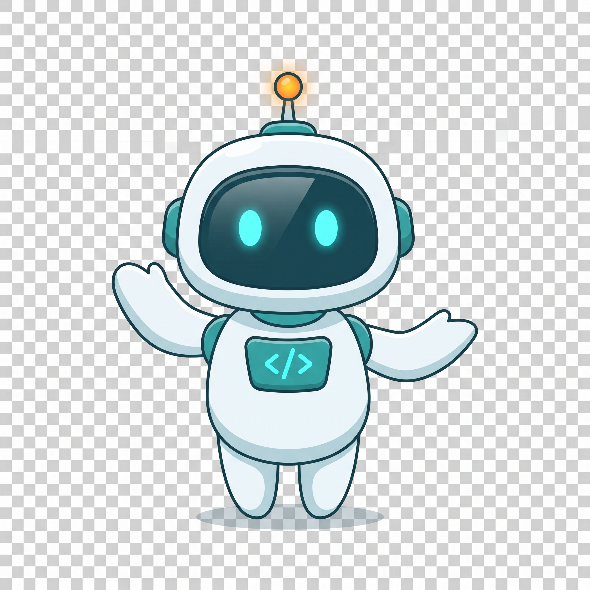
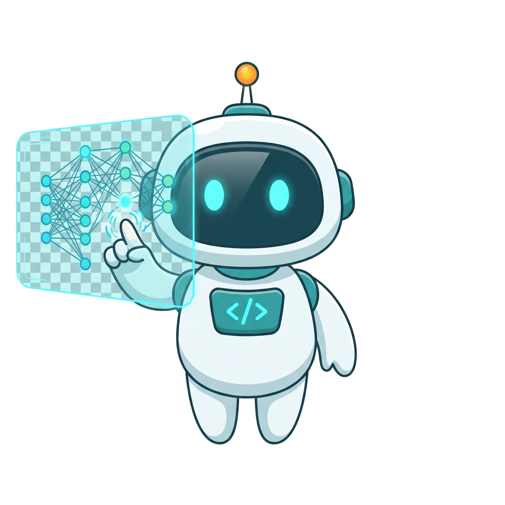
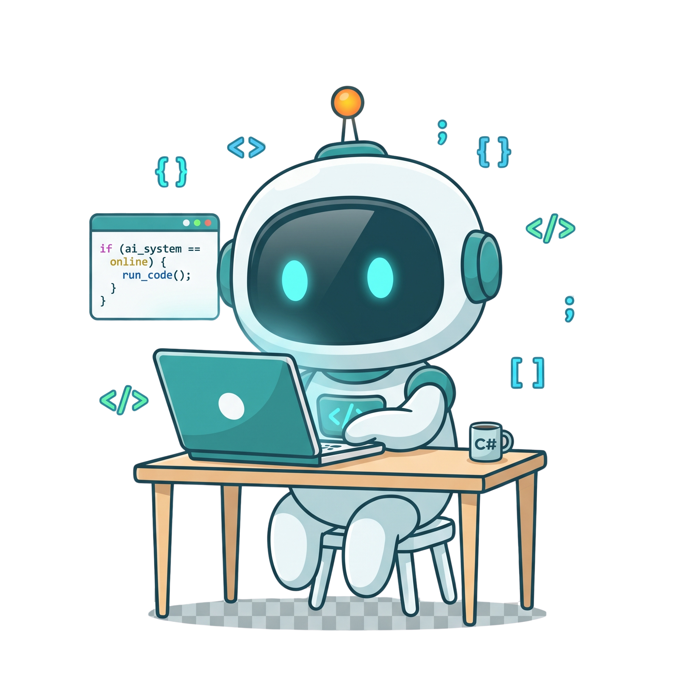
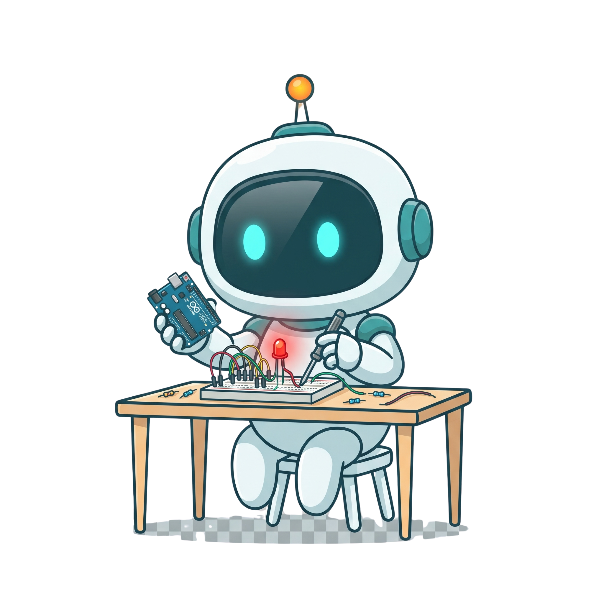
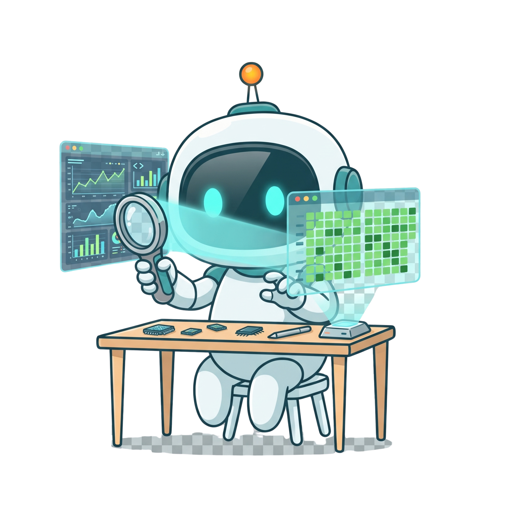
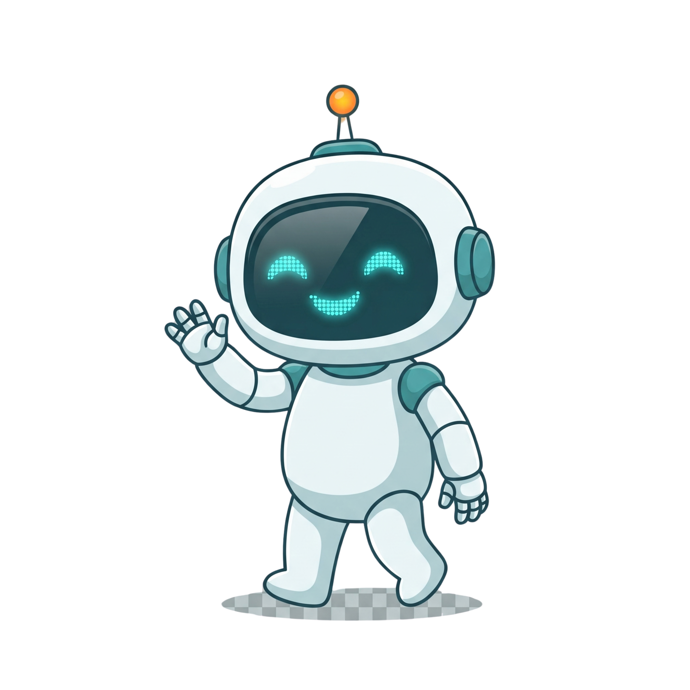

<!-- ============================================================
  GitHub Profile README - Subhan
  Replace every YOUR_USERNAME and [PLACEHOLDER] before committing.
  Robot images go in an /assets folder (see filenames below).
============================================================ -->

<div align="center">



# Hi, I'm Subhan 👋

**Computer Science student building across AI, software, cloud, and hardware.**


</div>

---

## 🧭 About Me

I'm a CS student who likes to experiment across the whole stack: from **AI / ML** models, to **software** and **web** projects, to the **cloud**, and all the way down to **hardware with Arduino**. I learn by building, breaking, and rebuilding.

**Focus areas:** Software Development · AI / ML · Cloud · Cybersecurity

```
AI / ML  →  Software  →  Web  →  Cloud  →  Hardware / Arduino
```

---

## 🤖 AI / ML



Exploring machine learning and building with modern AI tools.


<br clear="right" />

---

## 💻 Software & Web Development



**Languages**


**Web**


<br clear="right" />

---

## ☁️ Cloud


---

## 🔌 Hardware / Embedded



Taking code off the screen and into the real world.


<br clear="right" />

---

## 🛠️ Tools & Environment


---

## 🌍 Community

- **MSA FAST Peshawar** — Vice President
- **AWS community involvement**
- **Microsoft Learn / Microsoft student community activities**
- **Notion community involvement**

---

## 📊 GitHub Activity

<div align="center">



<br />


</div>

---

## 📫 Let's Connect

- LinkedIn: https://www.linkedin.com/in/subhan-baig-b3023a331
- Email: subhanbaig123456@gmail.com
- Portfolio: https://subhan-baig.github.io/

<div align="center">



**Thanks for stopping by! 👋**

</div>
